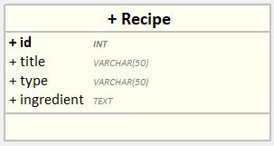

# Recette API

## Description

Ce projet backend a été développé en Express.js pour gérer des recettes via une API RESTful consommée par un frontend Vue.js. Le backend permet la gestion des recettes avec des fonctionnalités CRUD (Create, Read, Update, Delete) et est connecté à une base de données MySQL.

## Diagramme de classe



## Prérequis

Avant de commencer, assurez-vous d'avoir installé les éléments suivants :

- [Node.js]
- [npm]

## Installation

Suivez ces étapes pour configurer le projet sur votre machine locale :

1. **Clonez le repository :**

   ```bash
   git clone https://github.com/Zoubeir7/recette-API.git
   ```

2. **Installez les dépendances :**

   ```bash
   npm install
   ```

3. **Lancez le serveur Express.js :**

   ```bash
   npm start
   ```

## Auteur

[Zoubeir Ba](https://github.com/Zoubeir7)

## Contributeur

[Assa baradji](https://github.com/AssaBaradji)
